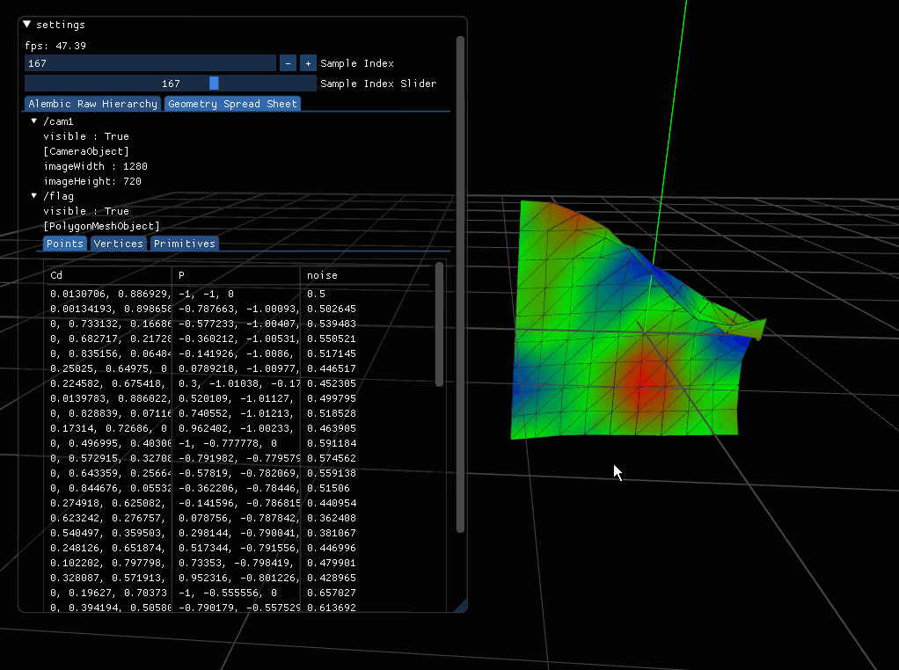

## Houdini Alembic Loader with Custom Attributes
- Read Custom Attributes (Polygon)
- Read Camera Parameters

## Dependencies
- bopenframeworks (0.10.1)
- Alembic (1.7.10) 

## Alembic Setup
It has already embedded by https://github.com/Ushio/PotableAlembic

No more "vcpkg install alembic:x64-windows" 
No more *.dll

## demo

## TODO
- Details Attributes
- Code Example
